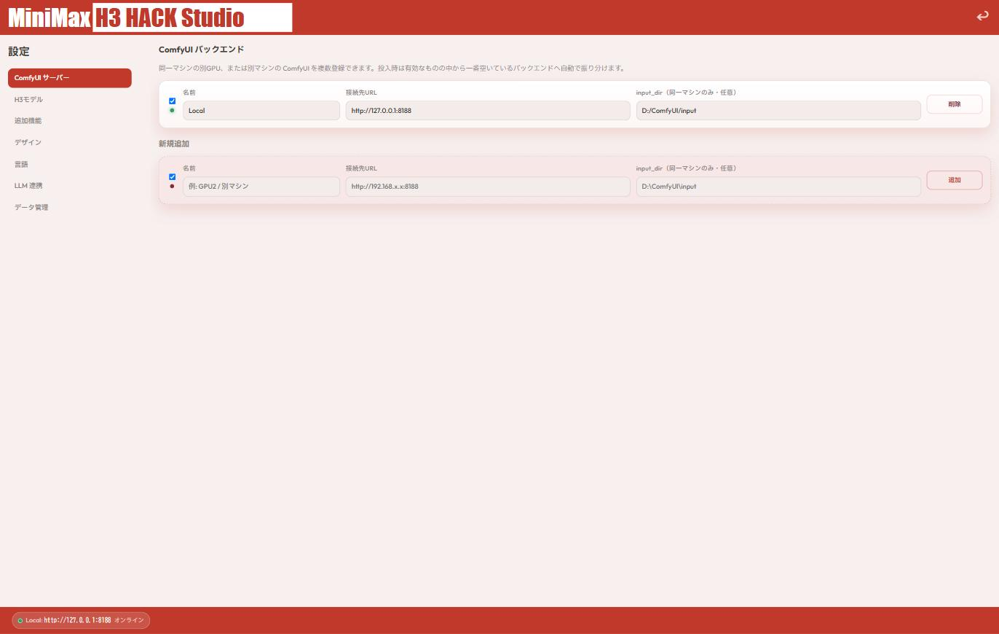
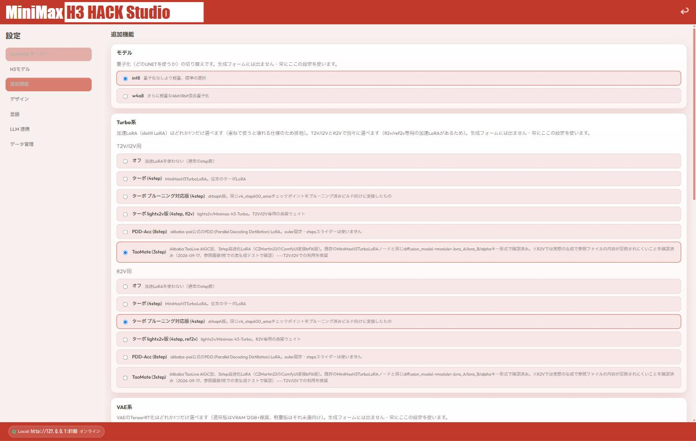
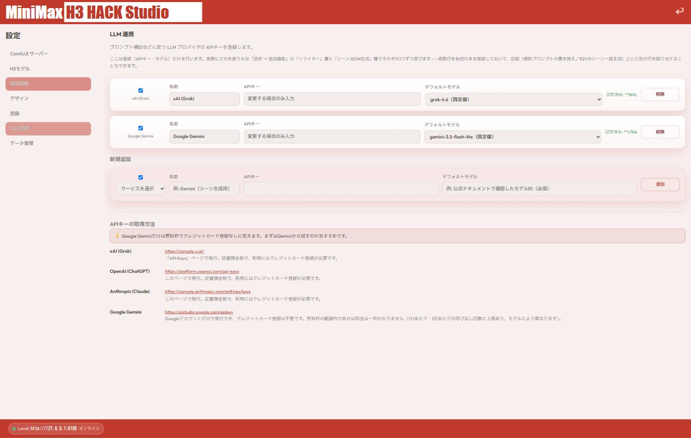
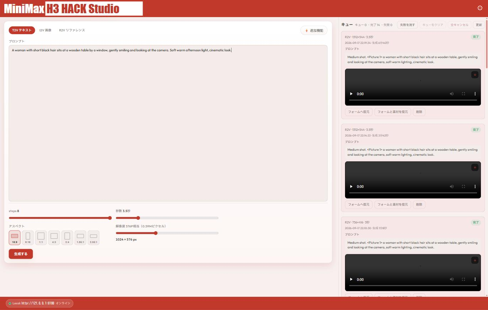
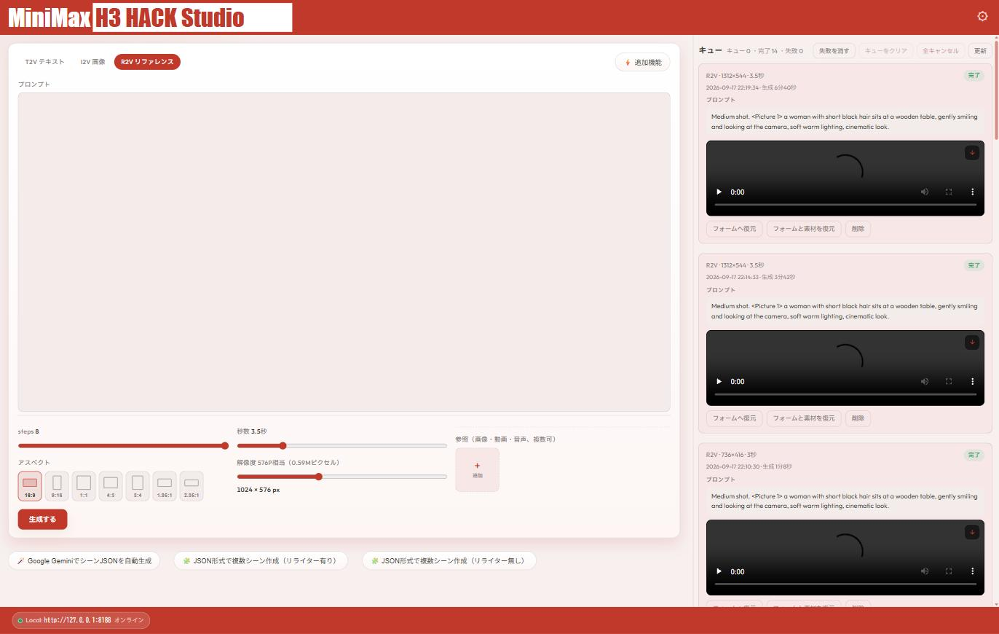

# 使い方ガイド

[English](USAGE.md) | [日本語](USAGE.ja.md)

インストール〜最初の動画生成までの流れを、実際の画面のスクリーンショット付きで
説明します。

## 1. インストール

インストーラー（`MiniMax_H3_HACK_Studio_Setup.exe`）を実行し、使用許諾契約に
同意してインストールします。完了後、デスクトップまたはスタートメニューから
起動してください。

## 2. ComfyUIバックエンドを登録する

初回起動後、まず**設定 → ComfyUIサーバー**で、実際にH3モデルが導入済みの
ComfyUIインスタンスを登録します。

- **名前**: 分かりやすい名前（例: `Local`）
- **接続先URL**: ComfyUIのURL（同一マシンなら通常 `http://127.0.0.1:8188`）
- **input_dir**（任意）: 同一マシン上にComfyUIがある場合のみ入力すると、
  参照ファイルのアップロードが少し速くなります。別マシンのComfyUIを登録する
  場合は空欄のままでOKです

同一マシンの別GPU・別マシンのComfyUIも複数登録でき、送信のたびに一番空いている
バックエンドへ自動で振り分けられます。

## 3.（任意）追加機能で高速化オプションを選ぶ

**設定 → 追加機能**で、量子化・Turbo系加速LoRA・VAE高速化などを設定できます。
生成フォームには出てこず、常にここで選んだ設定が使われます。

初めて使う場合は、デフォルト（int8量子化・加速LoRAなし）のままで問題なく動作
します。生成が速くなくて気になってきたら、この画面の説明を読みながら少しずつ
試してみてください。README記載の「オススメ（実測最速構成）」の組み合わせが
参考になります。

## 4.（任意）LLM連携でプロンプト補助を設定する

**設定 → LLM連携**で、xAI・OpenAI・Anthropic・Google GeminiのいずれかのAPI
キーを登録すると、プロンプトの自動リライトやR2Vの複数シーンJSON自動生成が
使えるようになります。

Google Geminiはクレジットカード登録なしの無料枠だけで使えるので、まず試して
みるのにおすすめです。この機能自体は任意なので、スキップしてもT2V/I2V/R2Vの
通常の生成には影響しません。

## 5. 動画を生成する

トップ画面に戻り、T2V（テキスト）・I2V（画像）・R2V（複数参照）いずれかの
タブを選んでプロンプトを入力します。

- **steps** / **秒数** / **解像度**: スライダーで調整（実際に送信される
  ピクセル数がリアルタイムに表示されます）
- **アスペクト**: プリセットから選択
- I2V/R2Vタブでは、参照画像・動画・音声ファイルをここに追加できます

入力できたら「**生成する**」を押すと、右側のキューにジョブが追加されます。

### 💡 Tips: ファイル名で@メンションが便利になる

R2Vで参照ファイルを追加すると、プロンプト欄で`@`を打つとその場でメンション
候補が出て、選ぶだけで`<Picture 1>`のようなタグを挿入できます。この時、
ファイル名を**「名前_特徴」**（アンダーバー1つで区切る）にしておくと、
候補一覧に「名前（特徴）」と分かりやすく表示されます。

例: `かな_白いエプロン.jpg` をアップロードしておくと、`@`入力時に
「かな（白いエプロン）」として候補に出てきます。複数キャラクターを参照する
時に、どのファイルがどのキャラか一目で分かるので便利です（アンダーバーが
無い・2個以上あるファイル名の場合は、説明無しでファイル名だけが候補に出ます）。

## 6. キューで結果を確認する

送信したジョブは右側のキューに並び、完了すると自動でその場に動画が表示されます
（インライン再生可能）。生成中のジョブは進捗も見えます。

「フォームへ復元」ボタンで、過去のジョブと同じ設定を生成フォームに呼び戻す
こともできます。

## 困ったときは

[Issues](../../issues) で質問・不具合報告を受け付けています。
